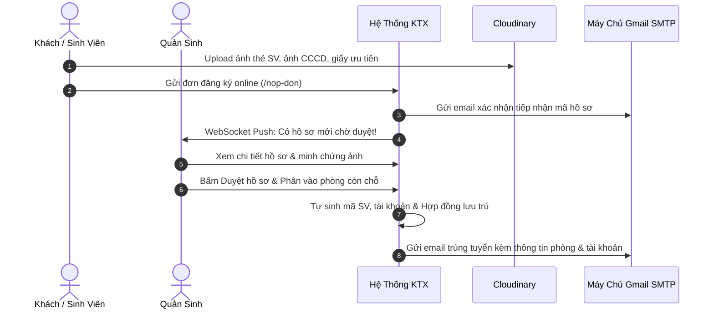
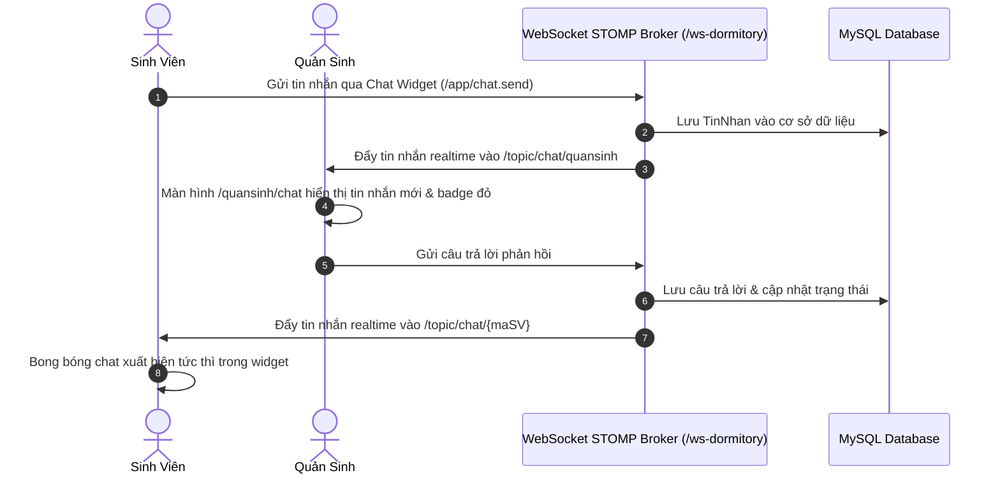
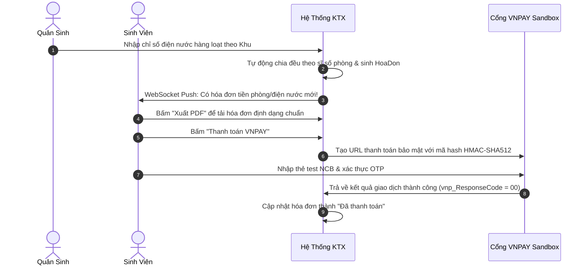

# 🏢 HỆ THỐNG QUẢN LÝ KÝ TÚC XÁ TƯ NHÂN (SMART DORMITORY MANAGEMENT SYSTEM)

Hệ thống Quản lý Ký túc xá Thông minh được xây dựng trên nền tảng **Java 21 LTS**, **Spring Boot 3.x**, **Spring Security 6** và **Thymeleaf**, áp dụng kiến trúc MVC chuẩn mực. Hệ thống định hướng phát triển theo mô hình **Ký túc xá Tư nhân Cao cấp** dành riêng cho sinh viên các trường Đại học và Cao đẳng. Toàn bộ quy trình từ khâu tìm hiểu, đăng ký phòng, xét duyệt, thanh toán, hợp đồng, phản ánh sự cố cho đến hỗ trợ trực tuyến đều được **số hóa 100% trên nền tảng web**, loại bỏ hoàn toàn các thủ tục giấy tờ truyền thống.

---

## 📑 MỤC LỤC
1. [Điểm Nhấn Nổi Bật Của Hệ Thống](#-điểm-nhấn-nổi-bật-của-hệ-thống)
2. [Công Nghệ & Thư Viện Sử Dụng](#-công-nghệ--thư-viện-sử-dụng)
3. [Tài Khoản Thử Nghiệm (Test Accounts)](#-tài-khoản-thử-nghiệm-test-accounts)
4. [Thông Tin Thẻ Test Thanh Toán VNPAY Sandbox](#-thông-tin-thẻ-test-thanh-toán-vnpay-sandbox)
5. [Toàn Bộ Chức Năng Phân Theo 5 Vai Trò](#-toàn-bộ-chức-năng-phân-theo-5-vai-trò)
6. [Chi Tiết 3 Tính Năng Nâng Cao Mới Nhất](#-chi-tiết-3-tính-năng-nâng-cao-mới-nhất)
7. [Định Mức Đơn Giá Điện Nước & Công Thức Tính Tiền](#-định-mức-đơn-giá-điện-nước--công-thức-tính-tiền)
8. [Sơ Đồ Luồng Nghiệp Vụ Chính (Mermaid Diagrams)](#-sơ-đồ-luồng-nghiệp-vụ-chính)
9. [Hướng Dẫn Cài Đặt & Khởi Chạy Dự Án](#-hướng-dẫn-cài-đặt--khởi-chạy-dự-án)
10. [Cấu Trúc Thư Mục Dự Án](#-cấu-trúc-thư-mục-dự-án)
11. [Kết Quả Kiểm Thử Tự Động (Automation Testing)](#-kết-quả-kiểm-thử-tự-động-automation-testing)

---

## 🌟 ĐIỂM NHẤN NỔI BẬT CỦA HỆ THỐNG

- 🚀 **Số hóa quy trình tiếp nhận 100% trực tuyến:** Sinh viên ở bất kỳ trường ĐH nào cũng có thể nộp đơn online, tải ảnh thẻ sinh viên, CCCD và giấy tờ ưu tiên lên đám mây Cloudinary. Mã sinh viên cư dân được tự động sinh theo mẫu chuẩn (`SVxxxxxx`).
- 🎓 **Hồ sơ sinh viên linh hoạt & Tự bổ sung Trường/Khoa:** Cho phép sinh viên chủ động cập nhật, bổ sung tên Trường Đại học và Khoa/Chuyên ngành trên trang cá nhân nếu Ban Quản Lý chưa điền, đồng bộ tức thời với cơ sở dữ liệu.
- 🔐 **Xác thực bảo mật đa tầng:** Mã hóa mật khẩu một chiều với **BCrypt**, cơ chế gửi mã OTP 6 số qua Email (SMTP Gmail) khi kích hoạt tài khoản cư dân và đặt lại mật khẩu.
- 🔔 **Thông báo đẩy tức thời (Real-time Push Notification):** Kiến trúc WebSocket STOMP qua SockJS, tự động nhảy số chuông và hiển thị popup Toast ngay khi có cập nhật mà không cần tải lại trang.
- 💬 **Live Chat Trực Tuyến Đa Nền Tảng (Sinh viên & Quản sinh):** 
  - Widget chat nổi dạng viên thuốc (Pill Button) cố định ở góc dưới bên phải màn hình cho cả **Sinh viên ("Chat với BQL")** và **Quản sinh ("Tin nhắn SV")**.
  - **Huy hiệu ĐỎ thông báo tin nhắn mới:** Tự động hiện số đỏ kèm hiệu ứng nhấp nháy tỏa sáng (`badge-chat-pulse`) và rung nhẹ nút như các ứng dụng Messenger / Zalo khi có tin nhắn chưa đọc. Đồng bộ badge đỏ trên menu Sidebar.
  - Quản sinh có thể trả lời nhanh ngay trên popup nổi hoặc truy cập Trung tâm điều phối toàn màn hình (`/quansinh/chat`).
- 📄 **Xuất file PDF Hợp đồng KTX & Hóa đơn Điện Nước:** Sử dụng OpenPDF tích hợp font TrueType Arial Unicode chuẩn tiếng Việt, bố cục văn bản hành chính quy chuẩn kèm chữ ký 2 bên.
- 💳 **Thanh toán tự động qua VNPAY Sandbox:** Tích hợp chữ ký số `HMAC-SHA512`, thanh toán an toàn qua thẻ ATM/QR ngân hàng, tự động gạch nợ hóa đơn tức thì.

---

## 🛠 CÔNG NGHỆ & THƯ VIỆN SỬ DỤNG

### Backend & Core
- **Ngôn ngữ:** Java 21 LTS
- **Framework nền tảng:** Spring Boot 3.x
- **Framework bảo mật:** Spring Security 6 (Phân quyền theo Role, CSRF protection linh hoạt)
- **Truy cập dữ liệu:** Spring Data JPA / Hibernate ORM
- **Giao tiếp Real-time:** Spring Boot Starter WebSocket, STOMP Protocol, SockJS
- **Xuất bản tài liệu PDF:** OpenPDF 2.0.3 (`com.github.librepdf:openpdf`)
- **Gửi Email tự động:** Spring Boot Starter Mail (SMTP Gmail)
- **Cơ sở dữ liệu:** MySQL 8.0+ / MariaDB
- **Build tool:** Apache Maven

### Frontend & Giao Diện
- **Template Engine:** Thymeleaf SSR (Server-Side Rendering)
- **UI Framework:** Bootstrap 5.3 & Custom Responsive CSS
- **Icon hệ thống:** FontAwesome 6 Pro Icons
- **Biểu đồ thống kê:** Chart.js (Dashboard Quản trị viên)
- **Thư viện WebSocket Client:** `sockjs-client 1.6.1`, `stompjs 2.3.3`

### Dịch Vụ Đám Mây & Tích Hợp Thứ Ba
- **Cổng thanh toán:** VNPAY Sandbox API (Mã hóa SHA512, IPN & Redirect callback)
- **Lưu trữ đa phương tiện:** Cloudinary Cloud Storage API (Lưu ảnh thẻ SV, ảnh CCCD, ảnh minh chứng hư hỏng & sửa chữa)

---

## 🔑 TÀI KHOẢN THỬ NGHIỆM (TEST ACCOUNTS)

Hệ thống tích hợp sẵn cơ chế **DataSeeder tự động**. Khi chạy lần đầu trên cơ sở dữ liệu mới, hệ thống tự động khởi tạo dữ liệu mẫu và các tài khoản sau:

| Phân hệ / Vai trò | Username | Mật khẩu | Quyền hạn (Role) | Chức năng chính |
|---|---|---|---|---|
| **Quản trị viên (Admin)** | `admin` | `123456` | `ROLE_QUAN_TRI` | Giám đốc KTX: Thống kê doanh thu, quản lý tài khoản nhân sự |
| **Quản sinh (Manager)** | `quansinh` | `123456` | `ROLE_QUAN_SINH` | Cán bộ quản lý: Duyệt hồ sơ online, phân phòng, lập hóa đơn, chat với SV |
| **Nhân viên kỹ thuật (Staff)** | `nhanvien` | `123456` | `ROLE_NHAN_VIEN` | Kỹ thuật viên: Tiếp nhận sửa chữa phòng, chụp ảnh nghiệm thu hoàn thành |
| **Sinh viên cư dân (Student)** | `SV001` | `123456` | `ROLE_SINH_VIEN` | Sinh viên nội trú: Xem phòng, tải hợp đồng PDF, thanh toán VNPAY, live chat |

> 📌 **Ghi chú tài khoản Sinh viên:**  
> - Sinh viên mới đăng ký online hoặc được duyệt hồ sơ sẽ có tên đăng nhập chính là **Mã Sinh Viên** (VD: `SV001`, `SV3625958`), mật khẩu mặc định là `123456` (hoặc mật khẩu do sinh viên tạo qua trang `/register`).
> - Có thể đổi mật khẩu bất kỳ lúc nào tại mục *Đổi mật khẩu* hoặc dùng tính năng *Quên mật khẩu* qua Email OTP.

---

## 💳 THÔNG TIN THẺ TEST THANH TOÁN VNPAY SANDBOX

Khi thực hiện thanh toán hóa đơn bằng cổng **VNPAY**, sử dụng thông tin thẻ thử nghiệm sau:

### 1. Thẻ ATM Nội Địa (Khuyên dùng - Ngân hàng NCB)
- **Ngân hàng:** Chọn biểu tượng ngân hàng **NCB** (Ngân hàng Quốc Dân)
- **Số thẻ:** `9704198526191432198`
- **Tên chủ thẻ:** `NGUYEN VAN A` *(viết hoa không dấu)*
- **Ngày phát hành:** `07/15` *(tháng 07 năm 2015)*
- **Mã OTP xác thực:** `123456`

### 2. Thẻ Thanh Toán Quốc Tế (Visa / Master)
- **Số thẻ:** `4111111111111111`
- **Tên in trên thẻ:** `NGUYEN VAN A`
- **Ngày hết hạn:** Bất kỳ ngày nào trong tương lai (VD: `12/28`)
- **Mã CVV/CVC:** `123`
- **Mã OTP:** `123456`

---

## 🌟 TOÀN BỘ CHỨC NĂNG PHÂN THEO 5 VAI TRÒ

### 0. Khách Vãng Lai & Người Dùng Chưa Đăng Nhập (Guest)
- **Trang chủ KTX (`/` và `/home`):** Giới thiệu mô hình KTX tư nhân cao cấp, tiêu chuẩn phòng ở, an ninh 24/7, không gian tự học.
- **Bảng giá & Các loại phòng:** Chi tiết các loại phòng (phòng 4 người, phòng 6 người, phòng 8 người), đơn giá lưu trú, hình ảnh và trang thiết bị.
- **Tra cứu phòng trống trực tuyến (`/tra-cuu-phong`):** Bộ lọc đa năng theo Tòa/Khu (Khu Nam, Khu Nữ), loại phòng, trạng thái phòng còn chỗ.
- **Nộp đơn đăng ký ở KTX Online 100% (`/nop-don`):**
  - Nhập thông tin cá nhân, trường Đại học đang theo học, diện ưu tiên.
  - Chọn nguyện vọng Tòa/Khu và Loại phòng mong muốn.
  - Tải ảnh chụp thẻ sinh viên, ảnh mặt trước/sau CCCD, giấy chứng nhận ưu tiên trực tiếp lên Cloudinary.
  - Hệ thống tự động cấp **Mã hồ sơ đăng ký** (VD: `DK3625958`) và gửi Email xác nhận tiếp nhận hồ sơ.
- **Tra cứu tiến độ hồ sơ (`/tra-cuu-ho-so`):** Tra cứu theo Mã hồ sơ, Email hoặc số CCCD để biết hồ sơ đang *Chờ duyệt*, *Đã duyệt* (kèm thông tin phòng) hay *Bị từ chối*.
- **Đăng ký tài khoản Sinh viên (`/register`):** Tự sinh mã SV, gửi mã OTP kích hoạt qua Email.
- **Quên mật khẩu (`/forgot-password`):** Gửi mã OTP xác thực qua Email và đặt lại mật khẩu mới an toàn.

---

### 1. Sinh Viên Cư Dân (Student - `/sinhvien/**`)
- **Dashboard Cư Dân:** Thẻ thông tin phòng đang ở, số hóa đơn chưa thanh toán, lịch sử vi phạm, thông báo mới.
- **Hồ Sơ Cá Nhân (`/sinhvien/profile`):** 
  - Xem thông tin cư dân, CCCD, giới tính, tình trạng phòng ở.
  - Cập nhật số điện thoại, email, quê quán, địa chỉ thường trú, thông tin phụ huynh liên hệ khẩn cấp.
  - **Bổ sung Trường Đại học & Khoa:** Cho phép sinh viên tự điền/bổ sung tên trường và khoa nếu Quản sinh chưa nhập khi lập hồ sơ.
- **Thông Tin Phòng Ở & Hợp Đồng (`/sinhvien/phong`):**
  - Xem thông tin phòng, danh sách bạn cùng phòng, thời hạn lưu trú; **tự động đồng bộ và hiển thị chính xác Khu/Phòng mới nhất** theo hợp đồng hiện hành (kể cả khi vừa chuyển phòng/đổi khu).
  - **Tải file PDF Hợp đồng lưu trú KTX** có giá trị pháp lý về máy.
  - Gửi yêu cầu *Xin chuyển phòng/đổi khu*, *Xin gia hạn hợp đồng* hoặc *Báo trả phòng* khi sắp hết hạn.
- **Báo Cáo Sự Cố Hỏng Hóc (`/sinhvien/sua-chua`):** Báo hỏng cơ sở vật chất kèm ảnh chụp thực tế (tải lên Cloudinary).
- **Hóa Đơn Điện Nước & Dịch Vụ (`/sinhvien/hoa-don`):**
  - Bảng kê chi tiết tiền phòng, chỉ số điện cũ/mới, chỉ số nước cũ/mới chia đều cho các thành viên trong phòng.
  - **Xuất file PDF Hóa đơn điện nước & phòng** phục vụ lưu trữ hoặc gửi gia đình.
  - Nút **"Thanh toán VNPAY"** trực tuyến: thanh toán tức thì qua ngân hàng.
- **Kỷ Luật - Vi Phạm (`/sinhvien/vi-pham`):** Theo dõi lịch sử biên bản vi phạm kỷ luật và hình thức xử lý của ban quản lý.
- **Floating Live Chat Widget & Menu Sidebar:** 
  - Nút nổi **"Chat với BQL"** ở góc dưới bên phải màn hình mọi trang, kèm mục **"Hỗ trợ & Chat BQL"** trên thanh menu bên trái.
  - **Badge ĐỎ đếm tin nhắn mới:** Tự động hiện số đỏ nhấp nháy khi có tin phản hồi từ BQL; click vào là mở ngay popup trò chuyện.
  - Hỗ trợ đường dẫn tắt `/sinhvien/chat` tự động mở chatbox ngay trên Dashboard.

---

### 2. Quản Sinh (Manager - `/quansinh/**`)
- **Dashboard Trung Tâm:** Thống kê nhanh số đơn chờ duyệt, số phòng còn trống, số sự cố chưa sửa, số hóa đơn chờ thu.
- **Xét Duyệt Hồ Sơ Đăng Ký Phòng:**
  - Bộ lọc hồ sơ theo Trạng thái, Khu, Loại phòng, Diện ưu tiên.
  - Xem ảnh thẻ SV, ảnh CCCD, giấy chứng minh ưu tiên phóng to qua modal.
  - **Phê duyệt đơn:** Tự động xếp vào phòng phù hợp (kiểm tra giới tính Nam/Nữ & số chỗ còn trống), sinh tài khoản và hợp đồng lưu trú, **tự động gửi Email chúc mừng trúng tuyển kèm thông tin phòng & tài khoản cho sinh viên**.
  - **Từ chối đơn:** Nhập lý do từ chối cụ thể, **tự động gửi Email thông báo lý do tới sinh viên**.
- **Quản Lý Phòng & Sĩ Số (144 Phòng Khu A, B, C):** Theo dõi chính xác 144 phòng KTX (4 tầng x 12 phòng/tầng), trạng thái Trống, Đang ở, Đầy phòng.
- **Quản Lý Sinh Viên & Chuyển Phòng:** 
  - Thêm mới, cập nhật hồ sơ, chỉnh sửa Trường Đại học & Khoa, khóa/mở tài khoản sinh viên.
  - **Điều chuyển phòng/khu:** Xử lý nguyện vọng chuyển phòng, tự động cập nhật hợp đồng lưu trú và đồng bộ trạng thái chỗ trống của các phòng liên quan.
- **Quản Lý Hợp Đồng Lưu Trú:** Lập hợp đồng mới, xem danh sách hợp đồng, duyệt gia hạn, thanh lý hợp đồng khi sinh viên rời KTX. **Hỗ trợ xuất PDF từng hợp đồng**.
- **Quản Lý Sửa Chữa Thiết Bị:** Nhận báo cáo hỏng từ sinh viên, phân công cho thợ sửa chữa, theo dõi tiến độ và kiểm tra ảnh nghiệm thu hoàn thành.
- **Quản Lý Hóa Đơn Điện Nước:**
  - Lập hóa đơn đơn lẻ.
  - **Ghi chỉ số hàng loạt:** Nhập chỉ số điện nước đồng loạt cho tất cả các phòng trong một Khu trên một bảng nhập duy nhất.
  - **Xuất PDF hóa đơn** cho từng phòng/sinh viên.
  - Xác nhận thanh toán tiền mặt.
- **Quản Lý Kỷ Luật - Vi Phạm:** Lập biên bản vi phạm, áp dụng các mức xử lý (Cảnh cáo, Trừ điểm rèn luyện, Bồi thường, Đuổi khỏi KTX).
- **Hệ Thống Live Chat Đa Nhiệm (Popup Nổi & Trang Đầy Đủ):**
  - **Nút nổi "Tin nhắn SV":** Cố định ở góc dưới bên phải màn hình Quản sinh; khi có sinh viên nhắn đến, badge đỏ lập tức nhảy số và nhấp nháy báo hiệu.
  - **Popup chat nhanh:** Xem danh sách hội thoại, tìm kiếm sinh viên và trả lời tức thì mà không cần rời khỏi trang đang làm việc.
  - **Trung tâm toàn màn hình (`/quansinh/chat`):** Giao diện chia 2 cột chuyên nghiệp để xử lý chuyên sâu nhiều hội thoại cùng lúc.

---

### 3. Nhân Viên Kỹ Thuật (Staff - `/nhanvien/**`)
- **Dashboard Công Việc:** Xem danh sách sự cố hư hỏng phòng được Quản sinh phân công.
- **Báo Cáo Nghiệm Thu Hoàn Thành:** Ghi chú nội dung công việc và linh kiện thay thế, chụp và tải lên **ảnh minh chứng sau khi sửa xong** (Cloudinary).
- **Thông Báo Giao Việc:** Nhận thông báo tức thời ngay khi có công việc mới hoặc công việc bị hủy.

---

### 4. Quản Trị Viên Hệ Thống (Admin - `/admin/**`)
- **Dashboard Doanh Thu & Thống Kê:** Biểu đồ doanh thu 12 tháng bằng Chart.js, thống kê tổng sinh viên, tổng nhân sự, tổng hóa đơn.
- **Giám Sát Trạng Thái Hệ Thống:** Thẻ giám sát tương phản cao (chữ trắng sắc nét trên nền Dark mode), theo dõi trực quan kết nối Database, Mail Server, Auto-Scheduler chạy định kỳ hàng ngày.
- **Quản Lý Tài Khoản Cán Bộ:** Thêm tài khoản quản sinh/nhân viên mới, chỉnh sửa thông tin, phân quyền và khóa/mở khóa tài khoản.
- **Quản Lý Danh Mục:** Tòa nhà (Khu A, B, C), Loại phòng, Đơn giá định mức.

---

## 🚀 CHI TIẾT 3 TÍNH NĂNG NÂNG CAO MỚI NHẤT

### 1. 🔔 Thông Báo Đẩy Tức Thời (Real-time Push Notification)
- **Giao thức:** WebSocket với chuẩn STOMP qua SockJS fallback trên endpoint `/ws-dormitory`.
- **Luồng hoạt động:**
  - Server kích hoạt thông báo qua `SimpMessagingTemplate` tới `/topic/thong-bao/{username}` hoặc `/topic/thong-bao/ROLE_QUAN_SINH`.
  - Client tự động bắt tín hiệu: tăng biến đếm huy hiệu trên chuông thông báo (`#bellBadge`), chèn thông báo mới với nhãn *"Vừa xong"* vào đầu dropdown và hiển thị **Toast Popup nổi** ở góc trên bên phải màn hình.
  - Người dùng không cần ấn F5 hoặc tải lại trang để biết có thông báo mới.

### 2. 📄 Xuất File PDF Hợp Đồng & Hóa Đơn (PDF Export)
- **Công nghệ:** Thư viện mã nguồn mở `OpenPDF 2.0.3` kết hợp font hệ thống Arial Unicode.
- **Hợp đồng lưu trú KTX:** Định dạng văn bản pháp quy Việt Nam chuẩn xác: Quốc hiệu, thông tin Bên A, Bên B, đối tượng và thời hạn thuê, giá tiền, trách nhiệm và ô ký tên đóng dấu 2 bên.
- **Hóa đơn điện nước & phòng:** Đầy đủ thông tin sinh viên, phòng, kỳ thu, bảng kê chi tiết chỉ số điện cũ/mới, chỉ số nước cũ/mới, đơn giá, số tiền chia theo đầu người trong phòng và tổng tiền thanh toán.
- **Bảo mật:** Kiểm tra phân quyền chặt chẽ; sinh viên chỉ được phép tải hợp đồng và hóa đơn thuộc quyền sở hữu của chính mình.

### 3. 💬 Live Chat Trực Tuyến & Thông Báo Đỏ (Realtime 2-Way Live Chat)
- **Kiến trúc giao tiếp:** Kết hợp WebSocket STOMP (kênh `/topic/chat/{maSV}` và `/topic/chat/quansinh`) cùng REST API fallback (`/api/chat/send`, `/api/chat/history`, `/api/chat/unread-count`).
- **Widget Chat Sinh Viên:** 
  - Nút nổi viên thuốc **"Chat với BQL"** tại góc dưới bên phải tất cả các trang.
  - Mục menu **"Hỗ trợ & Chat BQL"** trên thanh Sidebar bên trái và URL tắt `/sinhvien/chat` (tự động bật popup chat trên Dashboard).
  - Tự động nhận diện tin nhắn chưa đọc và hiển thị **badge đỏ nhấp nháy** (`badge-chat-pulse`) ngay khi tải trang hoặc khi có tin nhắn mới.
- **Widget & Trung Tâm Điều Phối Quản Sinh:**
  - **Nút nổi "Tin nhắn SV":** Cố định trên tất cả các trang nghiệp vụ của Quản sinh, báo đỏ khi có sinh viên gửi tin nhắn.
  - **Popup Mini-Chat:** Xem danh sách hội thoại, tìm kiếm sinh viên, trả lời tức thì tại chỗ mà không cần rời trang.
  - **Trung tâm toàn màn hình (`/quansinh/chat`):** Giao diện 2 cột chuyên sâu: tìm kiếm hội thoại, xem lịch sử tin nhắn, phản hồi nhanh chóng.
- **Cơ chế đánh dấu đã đọc:** Khi người dùng mở hộp chat hoặc chọn sinh viên, hệ thống tự động gọi API `/api/chat/read` để gạch nợ tin nhắn và tắt badge đỏ tức thời.

---

## ⚡ ĐỊNH MỨC ĐƠN GIÁ ĐIỆN NƯỚC & CÔNG THỨC TÍNH TIỀN

Hệ thống áp dụng đơn giá dịch vụ công khai và minh bạch:
- ⚡ **Đơn giá Điện sinh hoạt:** `3.500 đ / kWh`
- 💧 **Đơn giá Nước sinh hoạt:** `15.000 đ / m³`

### Công thức tính tự động chia đều cho sinh viên trong phòng:

$$\text{Tiền điện của SV} = \frac{(\text{Chỉ số Điện mới} - \text{Chỉ số Điện cũ}) \times 3.500\text{ đ}}{\text{Số lượng SV đang lưu trú trong phòng}}$$

$$\text{Tiền nước của SV} = \frac{(\text{Chỉ số Nước mới} - \text{Chỉ số Nước cũ}) \times 15.000\text{ đ}}{\text{Số lượng SV đang lưu trú trong phòng}}$$

$$\text{Tổng thanh toán} = \text{Tiền điện của SV} + \text{Tiền nước của SV} + \text{Tiền phòng/tháng}$$

---

## 🔄 SƠ ĐỒ LUỒNG NGHIỆP VỤ CHÍNH

### 1. Luồng Nộp Đơn Online, Phê Duyệt & Gửi Email Tự Động


### 2. Luồng Live Chat Trực Tuyến & Thông Báo WebSocket


### 3. Luồng Ghi Điện Nước, Xuất PDF & Thanh Toán VNPAY


---

## 🚀 HƯỚNG DẪN CÀI ĐẶT & KHỞI CHẠY DỰ ÁN

### 1. Yêu cầu môi trường
- **Java Development Kit (JDK):** Phiên bản **21** trở lên.
- **MySQL Server:** Phiên bản **8.0** trở lên (chạy ở cổng mặc định `3306`).
- **Apache Maven:** 3.8+ (hoặc dùng Maven Wrapper `mvnw.cmd` kèm theo).

### 2. Thiết lập Cơ sở dữ liệu
Mở MySQL Workbench hoặc MySQL CLI và tạo database:
```sql
CREATE DATABASE dormitory_db CHARACTER SET utf8mb4 COLLATE utf8mb4_unicode_ci;
```

### 3. Cấu hình ứng dụng
Kiểm tra cấu hình trong file `src/main/resources/application.properties`:
```properties
spring.datasource.url=jdbc:mysql://localhost:3306/dormitory_db?useSSL=false&serverTimezone=UTC&allowPublicKeyRetrieval=true
spring.datasource.username=root
spring.datasource.password=123456

# Cấu hình VNPAY Sandbox (Đã có sẵn cấu hình test)
vnpay.tmn-code=CL3Q4HKJ
vnpay.hash-secret=TQSYLAOZAEUPLAZPUCMTGWFZCDSRXVAP
vnpay.url=https://sandbox.vnpayment.vn/paymentv2/vpcpay.html
vnpay.return-url=http://localhost:8080/sinhvien/vnpay/return

# Cấu hình Cloudinary (Lưu trữ ảnh online)
cloudinary.cloud-name=your_cloud_name
cloudinary.api-key=your_api_key
cloudinary.api-secret=your_api_secret
```

### 4. Biên dịch và Khởi động
Chạy ứng dụng bằng một trong các cách sau:

**Dùng Maven trực tiếp:**
```powershell
mvn clean compile spring-boot:run
```

**Hoặc dùng Maven Wrapper:**
```powershell
.\mvnw.cmd spring-boot:run
```

Truy cập ứng dụng tại địa chỉ: **[http://localhost:8080](http://localhost:8080)**

---

## 📂 CẤU TRÚC THƯ MỤC DỰ ÁN

```text
dormitory-management/
├── src/
│   ├── main/
│   │   ├── java/vn/iotstar/dormitory/
│   │   │   ├── component/          # DataSeeder (Tự động sinh dữ liệu & tài khoản mẫu)
│   │   │   ├── config/             # WebSocketConfig, SecurityConfig, VNPAYConfig
│   │   │   ├── controller/         # Admin, QuanSinh, SinhVien, NhanVien, Chat, Auth Controllers
│   │   │   ├── dto/                # Data Transfer Objects (NopDon, TinNhan, HoiThoai, Register, ViPham...)
│   │   │   ├── entity/             # JPA Entities (NguoiDung, SinhVien, Phong, HoaDon, HopDong, TinNhan...)
│   │   │   ├── repository/         # Spring Data JPA Repositories
│   │   │   ├── security/           # CustomUserDetailsService, CustomUserDetails
│   │   │   ├── service/            # Business Services (ChatService, PdfExportService, VNPAYService...)
│   │   │   └── util/               # VNPAYUtil (Mã hóa HMAC-SHA512)
│   │   └── resources/
│   │       ├── static/css/         # style.css (Tùy biến giao diện, hiệu ứng Glassmorphism)
│   │       ├── templates/          # Giao diện Thymeleaf HTML
│   │       │   ├── admin/          # Giao diện Quản trị viên
│   │       │   ├── auth/           # Giao diện Đăng ký, OTP, Quên mật khẩu
│   │       │   ├── guest/          # Giao diện Tra cứu phòng, Tra cứu hồ sơ, Nộp đơn online
│   │       │   ├── quansinh/       # Giao diện Quản sinh & Trung tâm Live Chat (/quansinh/chat)
│   │       │   ├── sinhvien/       # Giao diện Sinh viên nội trú
│   │       │   ├── nhanvien/       # Giao diện Nhân viên kỹ thuật sửa chữa
│   │       │   ├── fragments/      # Header (WebSocket Toast), Sidebar, Chat Widget, Pagination
│   │       │   ├── home.html       # Landing page giới thiệu KTX
│   │       │   ├── login.html      # Trang đăng nhập hệ thống
│   │       │   └── error.html      # Trang báo lỗi 403, 404, 500 thân thiện
│   │       └── application.properties # Cấu hình kết nối DB, Mail, VNPAY, Cloudinary
│   └── test/
│       └── java/vn/iotstar/dormitory/
│           ├── DormitoryFlowIntegrationTest.java # Bộ 21 kịch bản kiểm thử tích hợp toàn diện
│           └── DormitoryManagementApplicationTests.java
├── pom.xml                         # Cấu hình Maven dependencies & OpenPDF, WebSocket
└── README.md                       # Tài liệu kỹ thuật chi tiết của dự án
```

---

## 🧪 KẾT QUẢ KIỂM THỬ TỰ ĐỘNG (AUTOMATION TESTING)

Toàn bộ các luồng nghiệp vụ từ Guest, Xác thực OTP, Sinh viên, Quản sinh, Admin đến 3 tính năng nâng cao (WebSocket Notification, PDF Export, Live Chat) đều được kiểm thử tự động bằng **JUnit 5** và **MockMvc**:

### Danh mục 22 kịch bản kiểm thử tích hợp:
1. **Guest Flow (4 tests):**
   - `Guest 1`: Trang chủ KTX hiển thị thành công (`GET /`)
   - `Guest 2`: Tra cứu và lọc phòng công khai (`GET /tra-cuu-phong`)
   - `Guest 3`: Nộp đơn đăng ký ở ký túc xá online và tự động lưu Cloudinary/DB (`POST /nop-don`)
   - `Guest 4`: Tra cứu hồ sơ theo CCCD/Mã hồ sơ (`GET /tra-cuu-ho-so`)
2. **Authentication & OTP Flow (3 tests):**
   - `Auth 1`: Đăng ký tài khoản Sinh viên và sinh OTP 6 số ngẫu nhiên
   - `Auth 2`: Kích hoạt tài khoản bằng mã OTP gửi qua Email SMTP
   - `Auth 3`: Quên mật khẩu và đặt lại mật khẩu an toàn bằng OTP
3. **Quản Sinh Flow (3 tests):**
   - `Quản sinh 1`: Đăng nhập & truy cập Dashboard Quản sinh thành công
   - `Quản sinh 2`: Phê duyệt đơn nộp online, tự động phân phòng và cấp tài khoản SV
   - `Quản sinh 3`: Từ chối đơn đăng ký có lý do cụ thể, tự động gửi Email giải thích
4. **Sinh Viên Flow (4 tests):**
   - `Sinh viên 1`: Xem thông tin hồ sơ cá nhân (`/sinhvien/profile`)
   - `Sinh viên 2`: Cập nhật thông tin cá nhân kèm tự bổ sung Trường Đại học & Khoa
   - `Sinh viên 3`: Báo cáo sự cố hư hỏng cơ sở vật chất phòng
   - `Sinh viên 4`: Xem danh sách hóa đơn điện nước và trạng thái thanh toán
5. **Quản Trị Viên Flow (1 test):**
   - `Admin 1`: Đăng nhập, truy cập Dashboard Giám đốc/Admin và xem biểu đồ doanh thu
6. **3 Tính Năng Nâng Cao - PDF Export & Live Chat (6 tests):**
   - `Ý tưởng 2 - PDF`: Xuất hợp đồng lưu trú KTX sang định dạng PDF (OpenPDF chuẩn tiếng Việt)
   - `Ý tưởng 2 - PDF`: Xuất hóa đơn điện nước & phòng sang định dạng PDF
   - `Ý tưởng 3 - Live Chat`: Sinh viên gửi tin nhắn, lấy lịch sử và quản sinh phản hồi
   - `Ý tưởng 3 - Live Chat`: Quản sinh truy cập Trung tâm Live Chat toàn màn hình (`/quansinh/chat`)
   - `Ý tưởng 3 - Live Chat`: Đường dẫn tắt `/sinhvien/chat` chuyển hướng mở popup chat trên Dashboard
   - `Ý tưởng 3 - Live Chat`: API kiểm tra số lượng tin nhắn chưa đọc cho cả Sinh viên và Quản sinh
7. **System Core (1 test):**
   - `ContextLoads`: Kiểm tra toàn bộ Spring ApplicationContext nạp thành công

### Kết quả chạy lệnh `mvn test`:
```text
[INFO] -------------------------------------------------------
[INFO]  T E S T S
[INFO] -------------------------------------------------------
[INFO] Running vn.iotstar.dormitory.DormitoryFlowIntegrationTest
[INFO] Tests run: 21, Failures: 0, Errors: 0, Skipped: 0, Time elapsed: 125.7 s
[INFO] Running vn.iotstar.dormitory.DormitoryManagementApplicationTests
[INFO] Tests run: 1, Failures: 0, Errors: 0, Skipped: 0, Time elapsed: 0.039 s
[INFO] 
[INFO] Results:
[INFO] Tests run: 22, Failures: 0, Errors: 0, Skipped: 0
[INFO] -------------------------------------------------------
[INFO] BUILD SUCCESS
[INFO] -------------------------------------------------------
```

---

*Dự án Hệ thống Quản lý Ký túc xá Tư nhân Thông minh - Giải pháp số hóa toàn diện cho công tác quản lý và nâng cao chất lượng cuộc sống sinh viên.*
