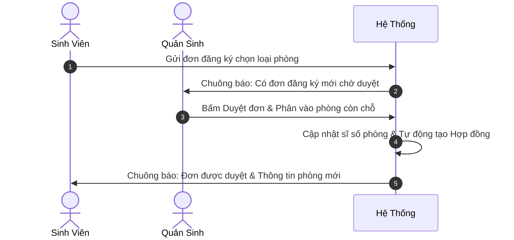
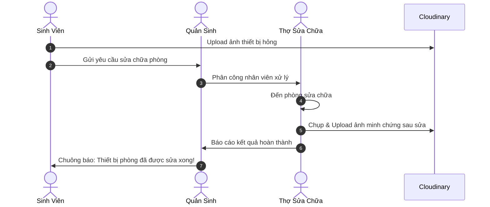
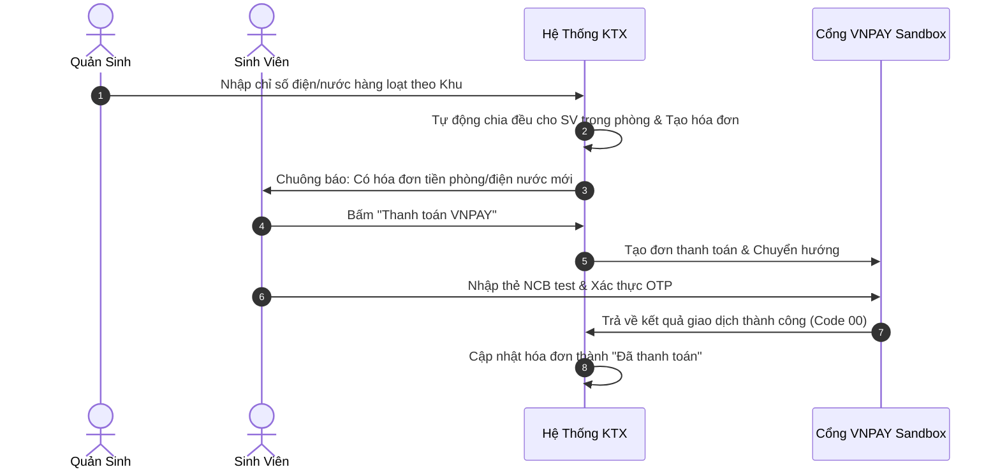

# 🏢 HỆ THỐNG QUẢN LÝ KÝ TÚC XÁ SINH VIÊN (DORMITORY MANAGEMENT SYSTEM)

Hệ thống Quản lý Ký túc xá được xây dựng trên nền tảng **Java 21**, **Spring Boot 3.x** và **Thymeleaf**, áp dụng kiến trúc MVC chuẩn mực. Hệ thống số hóa toàn diện quy trình vận hành ký túc xá đại học với 4 phân hệ người dùng: **Quản trị viên (Admin)**, **Quản sinh (Manager)**, **Nhân viên sửa chữa (Staff)** và **Sinh viên (Student)**.

---

## 📑 MỤC LỤC
1. [Công Nghệ & Thư Viện Sử Dụng](#-công-nghệ--thư-viện-sử-dụng)
2. [Tài Khoản Thử Nghiệm (Test Accounts)](#-tài-khoản-thử-nghiệm-test-accounts)
3. [Thông Tin Thẻ Test Thanh Toán VNPAY Sandbox](#-thông-tin-thẻ-test-thanh-toán-vnpay-sandbox)
4. [Định Mức Đơn Giá Điện Nước & Công Thức Tính Tiền](#-định-mức-đơn-giá-điện-nước--công-thức-tính-tiền)
5. [Toàn Bộ Chức Năng Phân Theo Vai Trò](#-toàn-bộ-chức-năng-phân-theo-vai-trò)
6. [Sơ Đồ Luồng Nghiệp Vụ Chính](#-sơ-đồ-luồng-nghiệp-vụ-chính)
7. [Hệ Thống Chuông Thông Báo Thông Minh](#-hệ-thống-chuông-thông-báo-thông-minh)
8. [Hướng Dẫn Cài Đặt & Khởi Chạy Dự Án](#-hướng-dẫn-cài-đặt--khởi-chạy-dự-án)
9. [Cấu Trúc Thư Mục Dự Án](#-cấu-trúc-thư-mục-dự-án)

---

## 🛠 CÔNG NGHỆ & THƯ VIỆN SỬ DỤNG

### Backend & Core
- **Ngôn ngữ:** Java 21 LTS
- **Framework:** Spring Boot 3.x (Spring Web MVC, Spring Data JPA, Spring Security 6)
- **Bảo mật & Phân quyền:** Spring Security, mã hóa mật khẩu một chiều bằng **BCrypt**
- **Cơ sở dữ liệu:** MySQL 8.x / MariaDB
- **Quản lý dependencies:** Apache Maven

### Frontend & View
- **Template Engine:** Thymeleaf (Server-Side Rendering không lưu cache khi dev)
- **Giao diện:** Bootstrap 5.3, FontAwesome 6 Pro icons
- **Biểu đồ thống kê:** Chart.js (thống kê doanh thu theo năm trên Admin Dashboard)
- **Thiết kế UI:** Glassmorphism, Micro-animations, loại bỏ triệt để hiện tượng nháy modal bằng cách tách ngữ cảnh xếp tầng CSS (*Stacking Context* ra cấp `<body>`)

### Dịch vụ Đám Mây & Tích Hợp Bên Thứ Ba
- **Cổng thanh toán trực tuyến:** **VNPAY Sandbox** (chuẩn mã hóa chữ ký `HMAC-SHA512`, xử lý phản hồi và IPN tự động)
- **Lưu trữ hình ảnh đám mây:** **Cloudinary API** (upload và phân phát ảnh sự cố hư hỏng & minh chứng sửa chữa)
- **Gửi Email tự động:** Spring Boot Starter Mail (SMTP Gmail)

---

## 🔑 TÀI KHOẢN THỬ NGHIỆM (TEST ACCOUNTS)

Hệ thống tích hợp sẵn cơ chế **DataSeeder tự động**. Khi khởi động lần đầu với cơ sở dữ liệu trống, hệ thống sẽ tự động tạo sẵn các tài khoản sau:

| Vai trò | Tên đăng nhập (Username) | Mật khẩu mặc định | Quyền hạn (Role) | Mô tả vai trò |
|---|---|---|---|---|
| **Quản trị viên** | `admin` | `123456` | `ROLE_QUAN_TRI` | Giám đốc / Trưởng ban KTX: Quản lý nhân sự, xem biểu đồ doanh thu |
| **Quản sinh** | `quansinh` | `123456` | `ROLE_QUAN_SINH` | Cán bộ quản lý: Duyệt phòng, hợp đồng, hóa đơn, sửa chữa, vi phạm |
| **Nhân viên kỹ thuật** | `nhanvien` | `123456` | `ROLE_NHAN_VIEN` | Thợ sửa chữa: Nhận phân công sự cố, báo cáo hoàn thành kèm ảnh |
| **Sinh viên mẫu** | `SV001` | `123456` | `ROLE_SINH_VIEN` | Sinh viên: Đăng ký phòng, xem hóa đơn, thanh toán VNPAY, báo hỏng |

> 📌 **Lưu ý với Sinh viên:**  
> Quản sinh có thể tạo mới sinh viên bất kỳ tại trang *Quản lý sinh viên*. Tên đăng nhập của sinh viên chính là **Mã Sinh Viên** (VD: `SV002`, `23110294`), mật khẩu mặc định tự sinh là `123456`.

---

## 💳 THÔNG TIN THẺ TEST THANH TOÁN VNPAY SANDBOX

Khi sinh viên bấm thanh toán hóa đơn bằng **VNPAY**, hệ thống chuyển hướng sang cổng thanh toán thử nghiệm của VNPAY. Bạn hãy sử dụng thông tin thẻ sau để test:

### 1. Thẻ ATM Nội Địa (Khuyên dùng - Ngân hàng NCB)
- **Ngân hàng:** Chọn biểu tượng **NCB** (Ngân hàng Quốc Dân)
- **Số thẻ:** `9704198526191432198`
- **Tên chủ thẻ:** `NGUYEN VAN A` *(viết hoa, không dấu)*
- **Ngày phát hành:** `07/15` *(tháng 07 năm 2015)*
- **Mã OTP xác thực:** `123456`

### 2. Thẻ Thanh Toán Quốc Tế (Visa / Master)
- **Số thẻ:** `4111111111111111` hoặc `4000000000000002`
- **Tên in trên thẻ:** `NGUYEN VAN A`
- **Ngày hết hạn:** Bất kỳ ngày nào trong tương lai (VD: `12/28`)
- **Mã CVV/CVC:** `123`
- **Mã OTP:** `123456`

---

## ⚡ ĐỊNH MỨC ĐƠN GIÁ ĐIỆN NƯỚC & CÔNG THỨC TÍNH TIỀN

Hệ thống áp dụng đơn giá dịch vụ minh bạch, hiển thị rõ ràng trên giao diện của cả Quản sinh và Sinh viên:

- ⚡ **Đơn giá Điện sinh hoạt:** `3.500 đ / kWh`
- 💧 **Đơn giá Nước sinh hoạt:** `15.000 đ / m³`

### Công thức tính tự động cho từng sinh viên trong phòng:

$$\text{Tiền điện SV} = \frac{(\text{Chỉ số Điện mới} - \text{Chỉ số Điện cũ}) \times 3.500\text{ đ}}{\text{Số lượng SV đang lưu trú trong phòng}}$$

$$\text{Tiền nước SV} = \frac{(\text{Chỉ số Nước mới} - \text{Chỉ số Nước cũ}) \times 15.000\text{ đ}}{\text{Số lượng SV đang lưu trú trong phòng}}$$

$$\text{Tổng thanh toán của SV} = \text{Tiền điện SV} + \text{Tiền nước SV} + \text{Đơn giá phòng/tháng}$$

---

## 🌟 TOÀN BỘ CHỨC NĂNG PHÂN THEO VAI TRÒ

### 1. Phân Hệ Quản Trị Viên (Admin - `/admin/**`)
- **Dashboard Trung tâm:** Thống kê tổng nhân sự, tổng số sinh viên đang lưu trú, tổng hóa đơn, tổng yêu cầu sửa chữa.
- **Biểu đồ Doanh thu (Chart.js):** Theo dõi tổng doanh thu thu được theo 12 tháng trong năm, hỗ trợ chọn xem lại các năm trước.
- **Quản lý Tài khoản Cán bộ:** Danh sách người dùng nội bộ, thêm tài khoản mới, chỉnh sửa thông tin, phân quyền chức vụ, khóa/mở khóa tài khoản nhân viên.
- **Đổi mật khẩu tài khoản.**

### 2. Phân Hệ Quản Sinh (Manager - `/quansinh/**`)
- **Dashboard Tổng quan:** Xem nhanh số đơn đăng ký chờ duyệt, số phòng còn trống, số sự cố chưa phân công, biên lai chờ xác nhận.
- **Duyệt Đăng Ký Phòng:** Xem danh sách đơn đăng ký online từ sinh viên, xét duyệt hoặc từ chối kèm lý do.
- **Phân Phòng Tự Động & Phân Phòng Nhanh:** Xếp sinh viên vào phòng theo đúng loại phòng đăng ký, tự động kiểm tra sức chứa tối đa của phòng.
- **Quản lý Hợp Đồng Lưu Trú:** Tạo hợp đồng mới, xem danh sách hợp đồng (Còn hạn / Hết hạn / Đã thanh lý), phê duyệt yêu cầu gia hạn hợp đồng từ sinh viên, xử lý thanh lý hợp đồng khi sinh viên trả phòng.
- **Quản lý Sửa Chữa Thiết Bị:**
  - Tiếp nhận sự cố hư hỏng kèm hình ảnh sinh viên chụp.
  - Phân công một hoặc nhiều nhân viên kỹ thuật xử lý.
  - Hủy yêu cầu sửa chữa nếu báo cáo sai.
  - Xem kết quả sửa chữa kèm ảnh bằng chứng sau khi thợ hoàn thành.
- **Quản lý Sinh Viên:** Tìm kiếm theo Mã SV / Tên, xem hồ sơ chi tiết, thêm mới, sửa thông tin cá nhân.
- **Quản lý Phòng, Khu, Loại Phòng:** Thêm tòa nhà mới (Khu A, B, C,...), tạo loại phòng (phòng 4, 6, 8 người), thêm danh sách phòng.
- **Quản lý Hóa Đơn Điện Nước:**
  - Lập hóa đơn đơn lẻ cho từng phòng.
  - **Ghi chỉ số hàng loạt:** Nhập chỉ số điện nước đồng loạt cho toàn bộ các phòng trong một Khu chỉ với 1 bảng nhập duy nhất.
  - Xác nhận thu tiền mặt: Chuyển trạng thái từ "Chờ duyệt (Tiền mặt)" sang "Đã thanh toán".
- **Quản lý Kỷ Luật - Vi Phạm:**
  - Lập biên bản vi phạm kỷ luật cho sinh viên (về muộn, gây mất trật tự, nấu ăn trái phép,...).
  - Cập nhật hình thức kỷ luật: *Cảnh cáo, Trừ điểm rèn luyện, Bồi thường thiệt hại, Đuổi khỏi KTX*.

### 3. Phân Hệ Nhân Viên Sửa Chữa (Staff - `/nhanvien/**`)
- **Danh Sách Công Việc Được Giao:** Hiển thị danh sách các phòng được Quản sinh phân công đến sửa.
- **Báo Cáo Kết Quả Sửa Chữa:** Mở form báo cáo kết quả, ghi chú các công việc và vật tư đã làm, chụp và đính kèm **ảnh minh chứng sau khi sửa xong** (upload Cloudinary).
- **Chuông Thông Báo Việc Mới:** Nhận thông báo tức thì khi được giao việc hoặc khi công việc bị hủy.

### 4. Phân Hệ Sinh Viên (Student - `/sinhvien/**`)
- **Dashboard Sinh Viên:** Hiển thị thẻ phòng đang ở, số hóa đơn chưa thanh toán, số lần vi phạm kỷ luật.
- **Đăng Ký Lưu Trú Online:** Điền nguyện vọng loại phòng, ghi chú diện ưu tiên và nộp đơn trực tuyến.
- **Xem Phòng & Hợp Đồng:** Xem thông tin phòng, danh sách bạn cùng phòng, thời hạn hợp đồng. Gửi yêu cầu xin gia hạn hoặc trả phòng trực tuyến.
- **Báo Cáo Sự Cố Hỏng Hóc:** Gửi yêu cầu sửa chữa cơ sở vật chất, chụp ảnh thiết bị hỏng gửi trực tiếp lên hệ thống.
- **Hóa Đơn & Thanh Toán Trực Tuyến:**
  - Xem chi tiết từng khoản: tiền phòng, chỉ số điện cũ/mới, chỉ số nước cũ/mới.
  - Bấm **"Thanh toán VNPAY"** để thanh toán tự động qua thẻ ngân hàng hoặc quét QR.
- **Hồ Sơ Kỷ Luật - Vi Phạm:** Theo dõi các biên bản vi phạm của bản thân, xem hình thức xử lý của ban quản lý.
- **Đổi Mật Khẩu Cá Nhân.**

---

## 🔄 SƠ ĐỒ LUỒNG NGHIỆP VỤ CHÍNH

### 1. Luồng Đăng Ký Phòng & Ký Hợp Đồng


### 2. Luồng Báo Hỏng & Sửa Chữa Thiết Bị


### 3. Luồng Ghi Điện Nước & Thanh Toán VNPAY


---

## 🔔 HỆ THỐNG CHUÔNG THÔNG BÁO THÔNG MINH

Hệ thống chuông ở góc trên bên phải thanh Header hoạt động thời gian thực:

1. **Phần "Việc cần xử lý" (Todos):**
   - **Quản sinh:** Hiển thị số lượng đơn đăng ký chờ duyệt, sự cố chờ phân công, hóa đơn chờ thu tiền, biên bản vi phạm chờ xử lý, hợp đồng chờ gia hạn.
   - **Sinh viên:** Nhắc nhở số hóa đơn chưa thanh toán, biên bản vi phạm chờ xử lý.
   - **Nhân viên:** Nhắc số công việc sửa chữa đang tồn đọng.
2. **Phần "Cập nhật mới" (Updates):**
   - Thông báo chi tiết có badge màu đỏ **"Mới"**.
   - Bấm vào bất kỳ dòng thông báo nào, hệ thống sẽ **tự động chuyển đến đúng trang nghiệp vụ và đánh dấu đã đọc**, làm tắt chấm đỏ trên chuông.

---

## 🚀 HƯỚNG DẪN CÀI ĐẶT & KHỞI CHẠY DỰ ÁN

### 1. Yêu cầu môi trường
- **Java Development Kit (JDK):** Phiên bản **21** trở lên.
- **MySQL Server:** Phiên bản **8.0** trở lên (chạy ở cổng mặc định `3306`).
- **Apache Maven:** 3.8+ (hoặc dùng Maven Wrapper kèm theo dự án).

### 2. Thiết lập Cơ sở dữ liệu
Mở MySQL Workbench hoặc Terminal và tạo database:
```sql
CREATE DATABASE dormitory_db CHARACTER SET utf8mb4 COLLATE utf8mb4_unicode_ci;
```

### 3. Cấu hình ứng dụng
Mở file `src/main/resources/application.properties` và điều chỉnh thông số kết nối MySQL nếu cần:
```properties
spring.datasource.url=jdbc:mysql://localhost:3306/dormitory_db?useSSL=false&serverTimezone=UTC&allowPublicKeyRetrieval=true
spring.datasource.username=root
spring.datasource.password=123456

# Cấu hình VNPAY Sandbox (Đã cấu hình sẵn tài khoản test)
vnpay.tmn-code=CL3Q4HKJ
vnpay.hash-secret=TQSYLAOZAEUPLAZPUCMTGWFZCDSRXVAP
vnpay.url=https://sandbox.vnpayment.vn/paymentv2/vpcpay.html
vnpay.return-url=http://localhost:8080/sinhvien/vnpay/return

# Cấu hình Cloudinary (Dùng để upload ảnh sửa chữa)
cloudinary.cloud-name=your_cloud_name
cloudinary.api-key=your_api_key
cloudinary.api-secret=your_api_secret
```

### 4. Biên dịch và Khởi động
Chạy lệnh sau tại thư mục gốc của dự án:

**Trên Windows (PowerShell / CMD):**
```sh
mvn clean compile spring-boot:run
```

Hoặc dùng Maven Wrapper:
```sh
.\mvnw.cmd spring-boot:run
```

Truy cập ứng dụng tại: **[http://localhost:8080](http://localhost:8080)**

---

## 📂 CẤU TRÚC THƯ MỤC DỰ ÁN

```text
dormitory-management/
├── src/
│   ├── main/
│   │   ├── java/vn/iotstar/dormitory/
│   │   │   ├── component/          # DataSeeder (Tự sinh tài khoản & phòng mẫu)
│   │   │   ├── config/             # SecurityConfig, VNPAYConfig, WebMvcConfig
│   │   │   ├── controller/         # Admin, QuanSinh, SinhVien, NhanVien Controllers
│   │   │   ├── dto/                # Data Transfer Objects cho các form nhập liệu
│   │   │   ├── entity/             # Các Entity JPA (NguoiDung, SinhVien, Phong, HoaDon...)
│   │   │   ├── repository/         # Spring Data JPA Repositories
│   │   │   ├── security/           # CustomUserDetailsService, CustomUserDetails
│   │   │   ├── service/            # Business Logic Services
│   │   │   └── util/               # VNPAYUtil (Mã hóa SHA512, địa chỉ IP)
│   │   └── resources/
│   │       ├── static/css/         # style.css (Tuỳ biến giao diện, hiệu ứng)
│   │       ├── templates/          # Giao diện Thymeleaf HTML
│   │       │   ├── admin/          # Giao diện Quản trị viên
│   │       │   ├── quansinh/       # Giao diện Quản sinh
│   │       │   ├── sinhvien/       # Giao diện Sinh viên
│   │       │   ├── nhanvien/       # Giao diện Nhân viên sửa chữa
│   │       │   ├── fragments/      # Header, Sidebar, Head, Pagination dùng chung
│   │       │   ├── error.html      # Trang thông báo lỗi 403, 404, 500 tùy biến
│   │       │   └── login.html      # Trang đăng nhập
│   │       └── application.properties # Cấu hình DB, VNPAY, Cloudinary, Mail
├── pom.xml                         # Maven dependencies & plugins
└── README.md                       # Tài liệu hướng dẫn toàn diện dự án
```

---

*Dự án phát triển phục vụ công tác số hóa và nâng cao trải nghiệm quản lý ký túc xá thông minh.*
